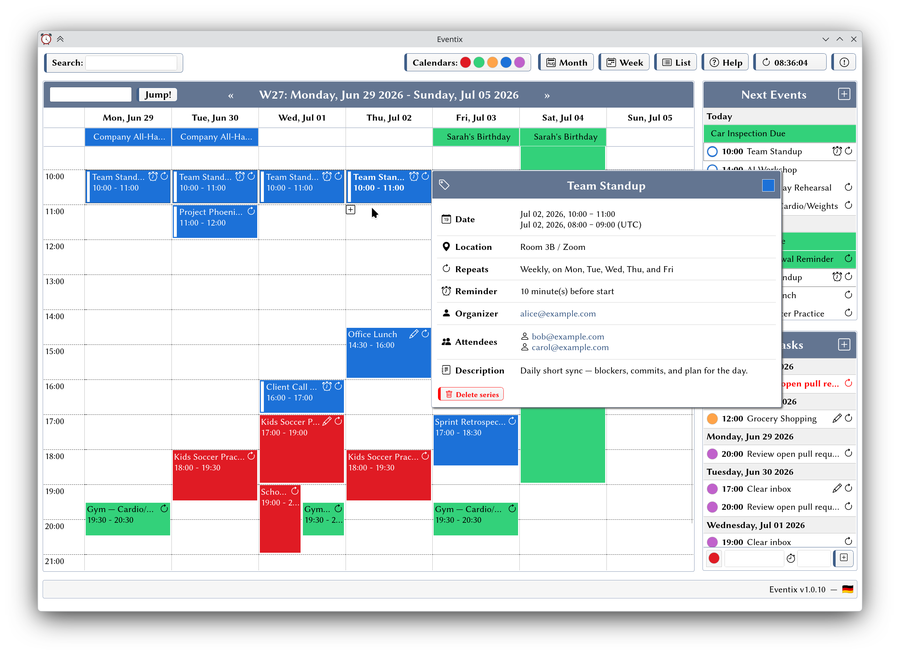
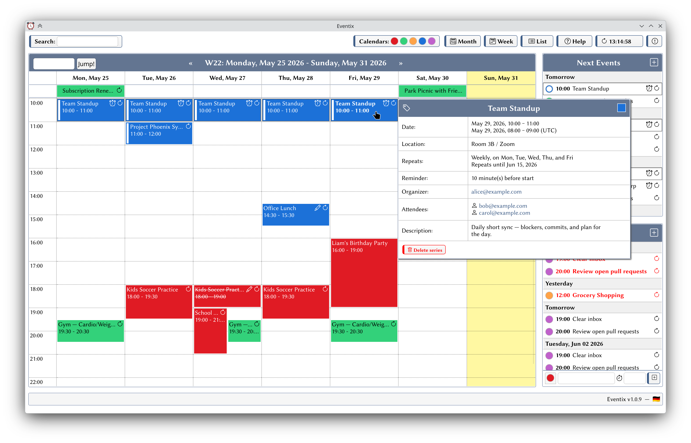
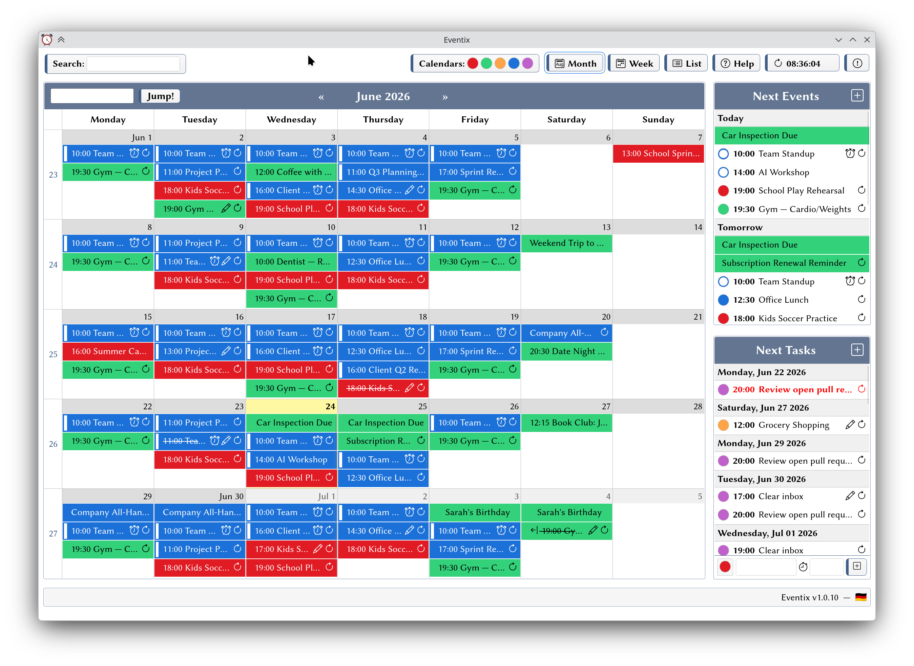
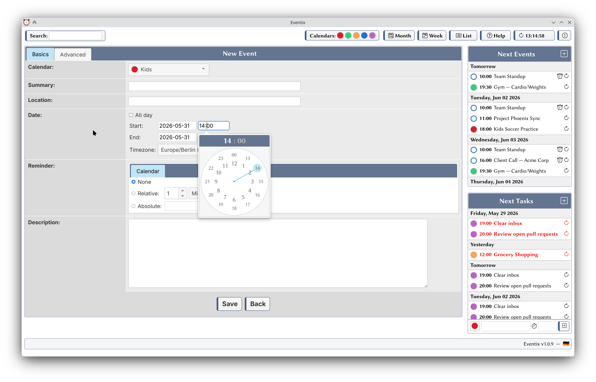
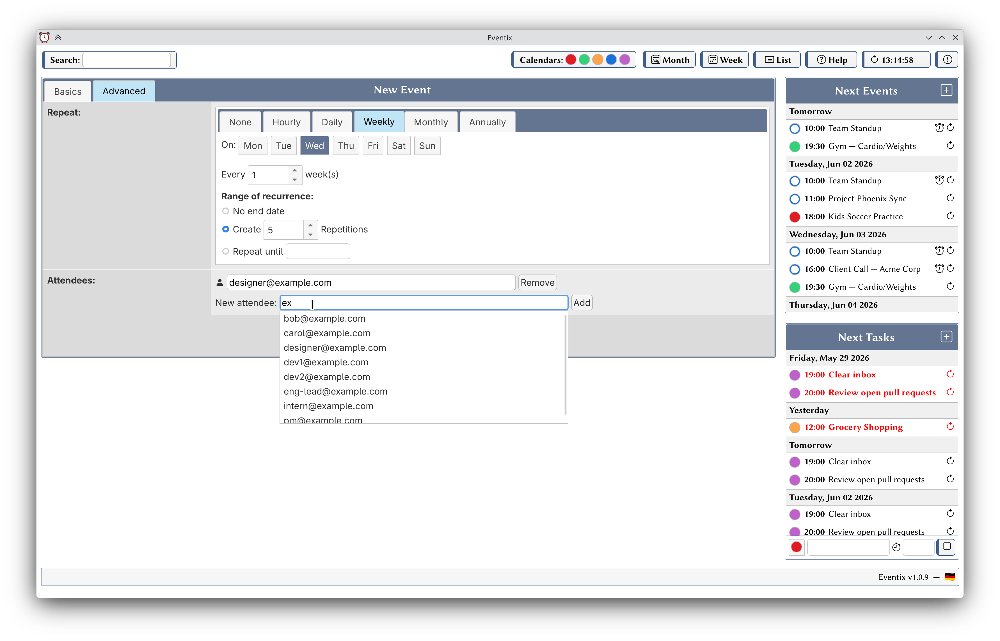
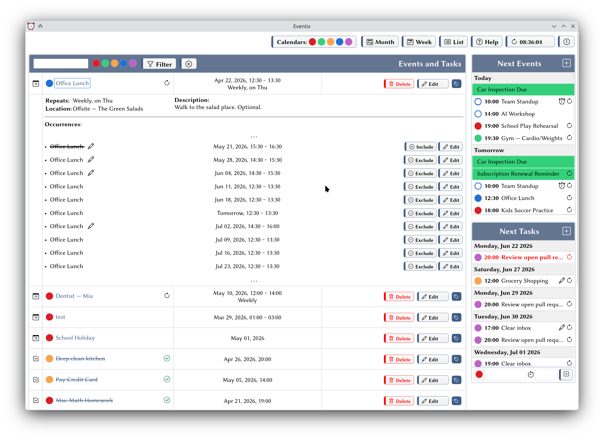
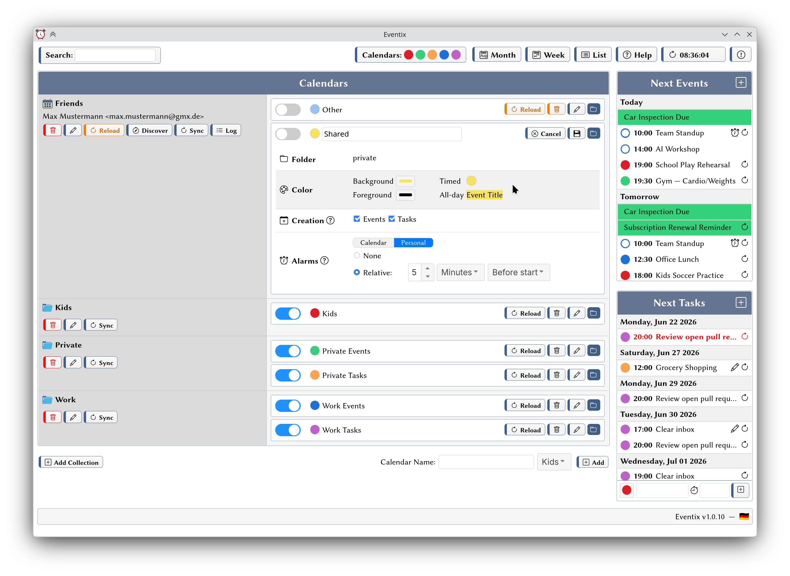
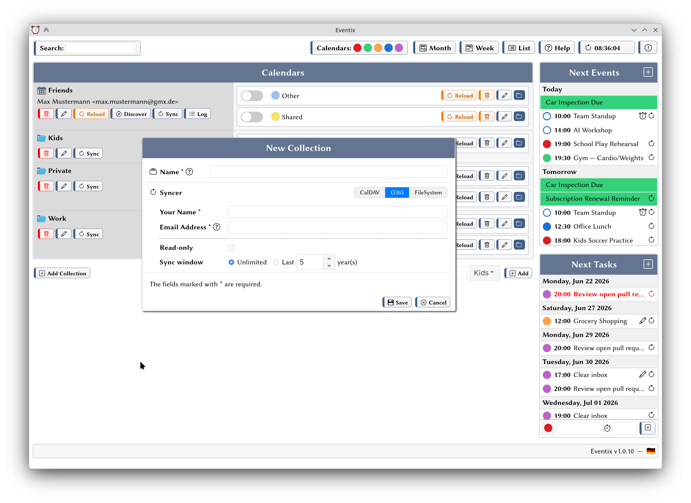

# Eventix

[](https://codecov.io/github/hrniels/Eventix)

Eventix is an iCalendar event and task manager for Linux desktops supporting CalDAV and Microsoft
365 (Exchange). It runs a local web server that provides a calendar UI, and ships a GTK desktop
wrapper that embeds that UI in a native application window with system tray integration.

## Features

- Monthly, weekly, and list calendar views
- Event and task management with full create / edit / delete support
- Mostly complete implementation of the iCalendar standard (RFC 5545)
- Recurrent events and tasks
- Organized events with attendees and accept/decline
- Alarm / notification system with per-calendar personal alarm overrides
- CalDAV synchronization via [vdirsyncer](https://github.com/pimutils/vdirsyncer) (bundled)
- Microsoft 365 synchronization via [DavMail](http://davmail.sourceforge.net/) (bundled)
- Local filesystem calendar support (no sync required)
- iCalendar (`.ics`) file import via a GTK dialog
- System tray icon showing due-today and overdue task counts
- Multi-language UI (English and German)
- XDG-compliant configuration and data storage
- Flatpak packaging (`io.github.hrniels.Eventix`)

## Screenshots

| | |
|:---:|:---:|
|  |  |
|  |  |
|  |  |
|  |  |

## Installation

Eventix is intended to be run as a Flatpak application and available on
[Flathub](https://flathub.org/en/apps/io.github.hrniels.Eventix). It can also be built and installed
from source:

```bash
./b flatpak
flatpak install --user flatpak/Eventix.flatpak
```

## Running

When using the default command, the GUI is started which will automatically start the server if it's
not already running. However, the server can also be started beforehand and run in the background.
One advantage is that the server can send notifications for calendar alarms even if the GUI is not
running.

You can start the server via:

```bash
flatpak run --command=eventix io.github.hrniels.Eventix
```

The flatpak package comes with a `.desktop` file for the GUI, but it can also be started via:

```bash
flatpak run io.github.hrniels.Eventix
```

It might also make sense to run the server via systemd:

```ini
[Unit]
Description=Eventix webserver

[Service]
Environment=RUST_LOG=info
ExecStart=/usr/bin/flatpak run --command=eventix io.github.hrniels.Eventix
ExecStop=/usr/bin/flatpak kill io.github.hrniels.Eventix
Restart=on-failure
KillMode=process

[Install]
WantedBy=default.target
```

## Relevant Files

Eventix can be configured completely via its web UI. However, in case manual inspection is desired,
configuration and other files are stored in XDG-standard locations under the app ID prefix
`io.github.hrniels.Eventix`. With flatpak, the base directory will be under
`$HOME/.var/app/io.github.hrniels.Eventix`. The relevant files and directories are:

| File                                                     | Purpose                                                   |
| -------------------------------------------------------- | --------------------------------------------------------- |
| `<base>/config/io.github.hrniels.Eventix/settings.toml` | Collection and calendar settings                          |
| `<base>/data/io.github.hrniels.Eventix/misc.toml`       | Runtime state: last alarm check, disabled calendars, etc. |
| `<base>/data/io.github.hrniels.Eventix/alarms`          | Personal alarms                                           |
| `<base>/data/io.github.hrniels.Eventix/vdirsyncer`      | Calendar files from remote servers                        |

## Architecture

The project is organized into binaries and libraries.

```
eventix/
├── bin/
│   ├── eventix/        # Core: Axum web server + calendar UI
│   ├── app/            # GTK desktop wrapper with system tray
│   ├── import/         # GTK dialog for importing .ics files
│   ├── getpw/          # Helper to access passwords from vdirsyncer
├── libs/
│   ├── ical/           # RFC 5545 iCalendar parser and object model
│   ├── state/          # Application state: settings, sync backends, alarms
│   ├── locale/         # Locale/i18n trait and English + German implementations
│   └── cmd/            # IPC protocol over a Unix domain socket
├── data/               # Runtime assets: icons, locale files, static web files
├── flatpak/            # Flatpak build manifests and .desktop files
├── contrib/davmail/    # DavMail submodule for Microsoft 365 CalDAV bridging
└── contrib/vdirsyncer/ # vdirsyncer submodule bundled with Eventix
```

## Notes

There is a [known problem](https://github.com/WebKit/WebKit/pull/34556) in WebKit when using
Wayland with fractional scaling at the moment, leading to suboptimal rendering quality. If you run
into this, you can switch to the X11 windowing system in the flatpak settings.

## License

Eventix is licensed under the [GNU General Public License v3.0 or later](LICENSE)
(SPDX: `GPL-3.0-or-later`).

Bundled third-party components retain their own licenses:

- [DavMail](http://davmail.sourceforge.net/) (`contrib/davmail/`) — GPL-2.0
- [vdirsyncer](https://github.com/pimutils/vdirsyncer) (`contrib/vdirsyncer/`) — BSD-3-Clause
